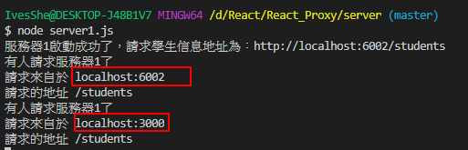

# React Proxy 配置代理 搭配Node.js服務器


# 建立新專案

react-proxy

```bash
create-react-app react-proxy
```

創建新專案，並只留需要的檔案，可以參考之前的文檔前面

https://github.com/IvesShe/React_TodoList


```bash
cd todolist-react
npm start
```

確定可以運行之後，開始刪除不需要的檔案，再運行確認工程可以正常運作

```bash
npm start
```

## 簡化之後的結構

修改App.js，改成App.jsx

並將 函數式組件 改成 類式組件

```js
import React, { Component } from 'react'

export default class App extends Component {
  render() {
    return (
      <div className="App">
        App....
      </div>
    );
  }
}
```


簡化的版本，可以正常運行


## src資料夾新增manifest.json

為防止報錯，在該資料夾新增manifest.json，並填入以下內容

manifest.json

```json
{

}
```


# 常用ajax請求庫

- jQuery : 比較重

- axiox : 輕量級
    1. 封裝XmlHttpRequest對象的ajax
    2. promise風格
    3. 可以用在瀏覽器端首node服務器端


# 安裝axiox

```bash
npm i axios
```


# 啟動node.js服務器


分別請求是會回傳資料的

附帶一提，可以安裝FeHelper擴充，方便閱讀

server1


server2


# 訪問服務器1

```js
import React, { Component } from 'react'
import axios from 'axios'
export default class App extends Component {

  getStudentData = ()=>{
    let url = 'http://localhost:6002/students'
    axios.get(url).then(
      response => {console.log('成功了',response.data);},
      error => {console.log('失敗了',error);}
    )
  }

  render() {
    return (
      <div>
        <button onClick={this.getStudentData}>點我獲取學生數據</button>
      </div>
    );
  }
}
```

server1

http://localhost:6002/students

直接訪問服務器1會跨域


但服務器1確實有被訪問


**ajax引擎不允許從客戶端localhost:3000訪問服務器2localhost:6002**

**ajax請求可以發送，但數據不會回傳回來**

# 代理

上述問題，需要透過代理來解決

需要透過一個中間服務器(開在與客戶端相同3000的端口)

# 第一種代理配置方式

修改客戶端react的package.json

增加一行

```json
"proxy":"http://localhost:6002"
```


修改App.jsx的請求網址，需請求客戶端自己的網段

```js
let url = 'http://localhost:3000/students'
```

可以請求了


目前的設置，會使客戶端所有3000端口的請求，都轉發到6002端口

如果客戶端端口3000有的資源，只會先請求自己，而不會透過proxy轉發到端口6002

# 第二種配置的代理方式

上一種方式，雖然方便，但一次只能配置一個代理端口，若有一個以上的，需要使用第二種方式

package.json刪除掉proxy的設定

在src資料夾新增setupProxy.js檔案

setupProxy.js

```js
const proxy = require('http-proxy-middleware')

module.exports = function(app){
    app.use(
        proxy('/api1',{ // 遇見/api1前綴的請求，就會觸發該代理配置
            // 請求轉發給誰
            target:'http://localhost:6002', 
            
            // 控制服務器收到的響應頭Host字段的值(改變原始的來源)
            // 為ture時會用target6002，為false時則使用客戶端原始的端口3000
            changeOrigin:true,  

            // 重寫請求路徑    
            pathRewrite:{'^/api1':''}
        }),
        proxy('/api2',{
            target:'http://localhost:6001',
            changeOrigin:true,
            pathRewrite:{'^/api2':''}
        })
    )
}
```


App.jsx請求作對應的修改

```jsx
getStudentData = ()=>{
    let url = 'http://localhost:3000/api1/students'
    axios.get(url).then(
      response => {console.log('成功了',response.data);},
      error => {console.log('失敗了',error);}
    )
  }

  getCarData = ()=>{
    let url = 'http://localhost:3000/api2/cars'
    axios.get(url).then(
      response => {console.log('成功了',response.data);},
      error => {console.log('失敗了',error);}
    )
  }
```

運行測試


## changeOrigin

```js
// 控制服務器收到的響應頭Host字段的值(改變原始的來源)
// 為ture時會用target6002，為false時則使用客戶端原始的端口3000
```

